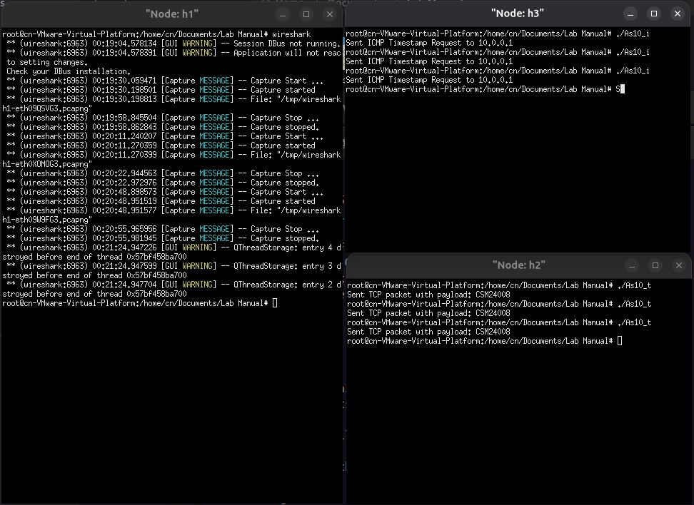

## HOW TO RUN

1. Create a network with 3 hosts using mininet.  
2. Run the tcp compiled code in host 2.  
3. Run the icmp compiled code in host 3.  
4. Run wireshark in host 1 to capture traffic.

#### Wireshark capture file :  [As10.pcapng](As10.pcapng)  
#### OUTPUT
