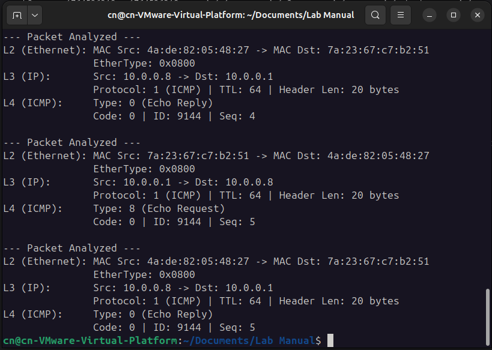

## HOW TO RUN

1. Create a tree network ```mn --topo tree,depth=3,fanout=2``` using mininet.  
2. Run the wireshark and capture in s1
3. Run ```ping 10.0.0.8 -c 5``` in h1
4. Save the pcapng file

#### Wireshark capture file :  [As13.pcapng](As13.pcapng)  
#### OUTPUT
