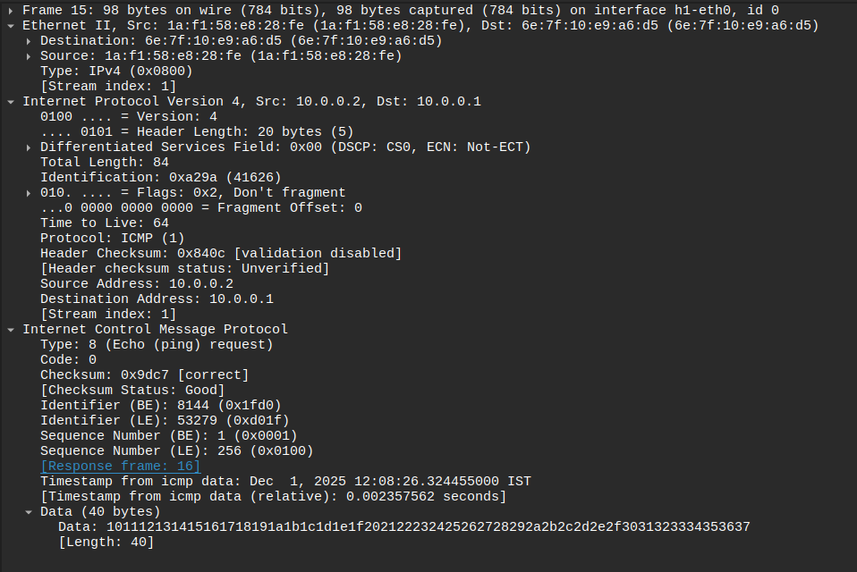
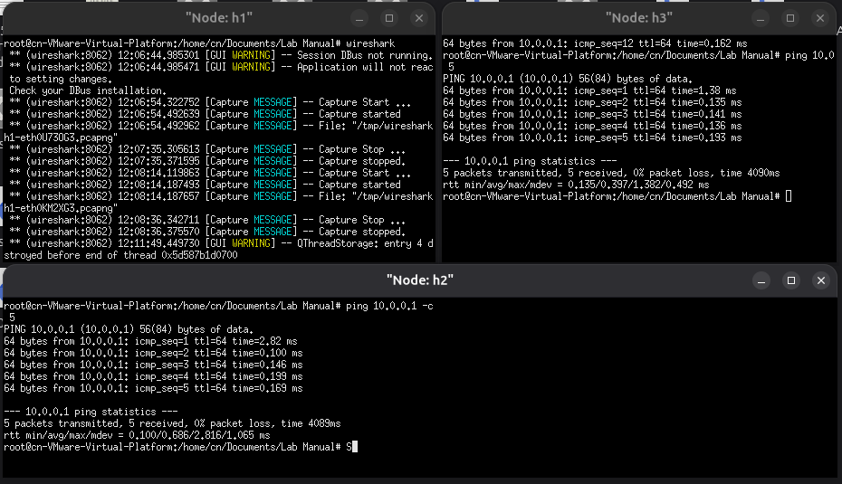

## HOW TO RUN
1. Create a network with 3 hosts using mininet
2. Run Wireshark on host 1
3. Ping from other host using ```ping 10.0.0.1 -c 5```

#### Wireshark capture file :  [As4.pcapng](As4.pcapng) 

#### HEADER INFO


#### OUTPUT

***Note : You may change the destination IPs to your liking in the code***
