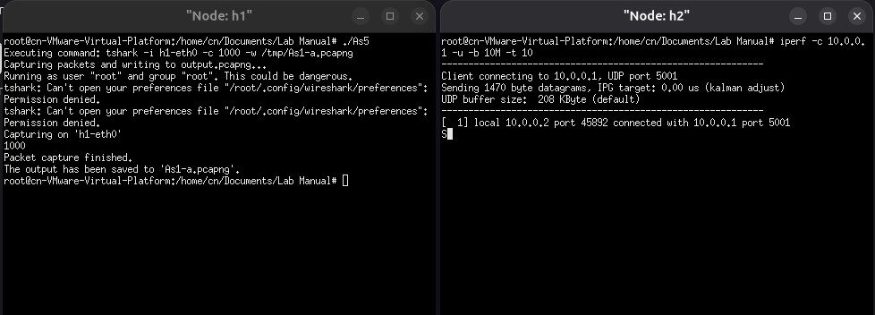

## HOW TO RUN
1. Create the default network using mininet (2 hosts)
2. Run the compiled code in host 1
3. Use iperf to generate packets

#### Usage :
Run in the other host.
```
iperf -c 10.0.0.1 -u -b 10M -t 10
```
#### OUTPUT


