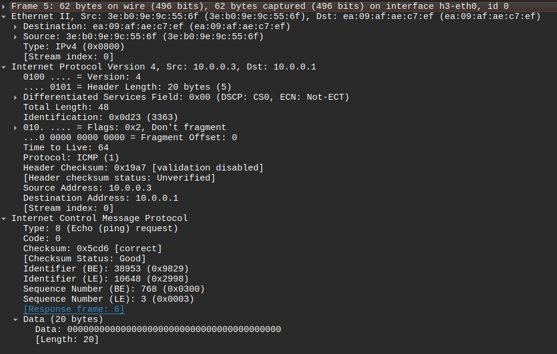
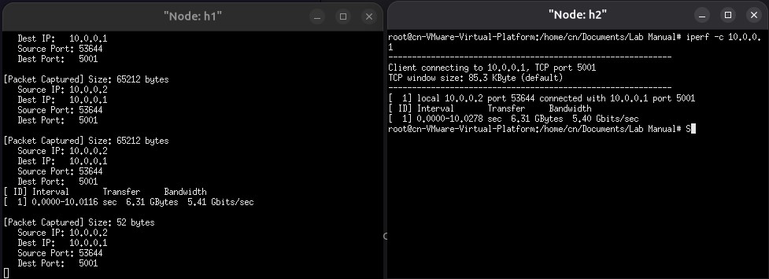

## HOW TO RUN
1. Create default mininet network
1. Use iperf -s & ./As6 in host 1
2. Use iperf -c 10.0.0.1 in host 2

This generates TCP traffic between host 1 & host 2

#### HEADER INFO

#### OUTPUT
