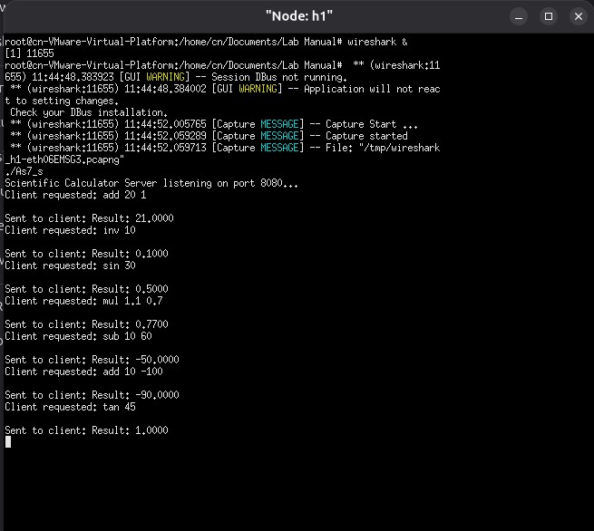
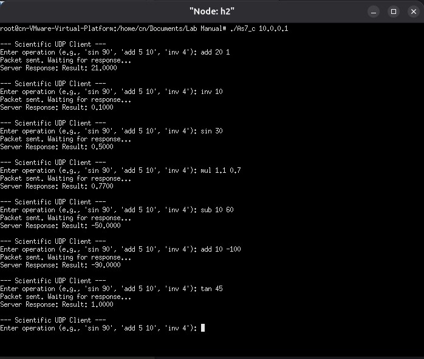

## HOW TO RUN
1. Create the default network using mininet (2 hosts)
2. Run server side code in host 1
3. Run client side code in host 2
4. Ready to execute!

#### Wireshark capture file :  [As7_gracefulUDP.pcapng](As7_gracefulUDP.pcapng)  
#### OUTPUT

##### Server-side

##### Client-side

