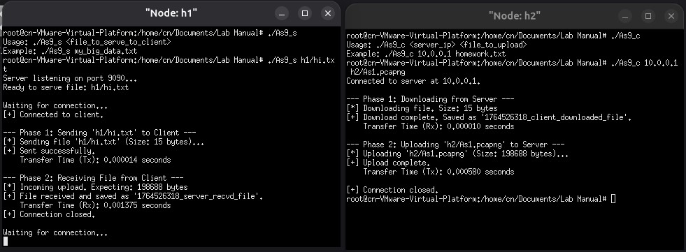

## HOW TO RUN
1. Create the default network using mininet (2 hosts)
2. Run server side code in host 1
3. Run client side code in host 2
#### Usage : Server side
```
./As9_s <file_to_serve_client>
```
#### Usage : Client side
```
./As9_c <server_ip> <file_to_upload>
```

#### OUTPUT


