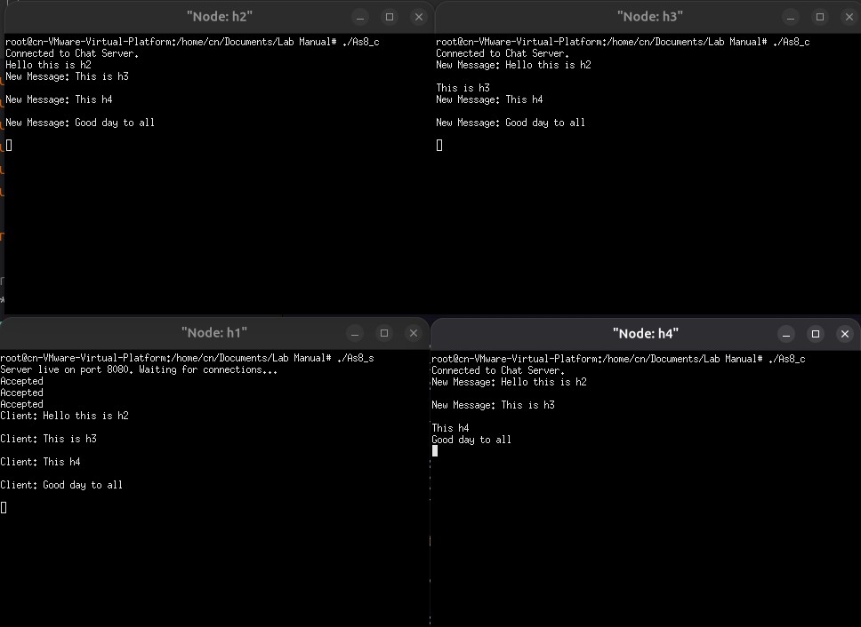

# COMPUTER NETWORKS : LAB MANUAL ASSIGNMENTS
## Q1. CN Lab – Assignment 1 
#### Objective:  
To gain first hands on experience of basic Socket Programming. 
#### Exercise:  
Write a program to run TCP client and server socket programs where client first says “Hi” and in response server says “Hello”.  
#### Steps/ Hints: (if any):  
1. Create two mininet hosts,  
2. Open the hosts individually in xterm windows, 
3. In one host, run tcpserver program and then in another run the tcpclient.  
#### Learning Outcomes:  
1. Basics of TCP client and server programming.
   
## OUTPUT 
#### *[readme file](Assignment1/Readme.md)*
#### *EXECUTION*


## Q2. CN Lab – Assignment 2 
### Objective:  
To gain experience of TCP Socket Programming for simple applications. 
### Exercise:  
Write a program using TCP socket to implement the following:  
i. Server maintains records of fruits in the format: fruit-name, quantity Last-sold, (server timestamp),  
ii. Multiple client purchase the fruits one at a time,  
iii. The fruit quantity is updated each time any fruit is sold,  
iv. Send regret message to a client if therequested quantityof the fruit is not available.  
v. Display the customer ids <IP, port> who has done transactions already. This list should be updated in the server every time a transaction occurs.  
vi. The total number of unique customers who did some transaction will be displayed to the customer every time.  
### Steps/ Hints: (if any)   
1. Use at least two mininet hosts as clients,  
2. Server must be kept running using a loop condition, 
3. Take another socket (from accept() call) for keeping client information, 
4. Server must send the current stock information to the transacting host as queried in the question.     
### Learning Outcomes:  
1. Multiple client’s communication via server socket can be learned.

## OUTPUT 
#### *[readme file](Assignment2/Readme.md)*
#### *EXECUTION*


## Q3. CN Lab – Assignment 3 
#### Objective: 
To gain experience of UDP Socket Programming for simple applications. 
#### Exercise: 
Redo assignment 2 using UDP socket.  
#### Steps/ Hints: (if any) 
Same as given in Assignment 1. 
#### Learning Outcomes:  
1. Basics of UDP socket programming. 

## OUTPUT 
#### *[readme file](Assignment3/Readme.md)*
#### *EXECUTION*


## Q4. CN Lab - Assignment 4  
#### Objective:  
To gain knowledge of packet capturing tools and understand header structures. 
#### Exercise:  
Install wireshark in a VM (Virtual Machine) environment. Draw a time diagram to show the steps in the protocols recorded in the captured file (saved in the .pcap file of wireshark) during a PING operation. List the L2, L3, L4 header fields that can be extracted from the .pcap file.  
#### Steps/ Hints: (if any)   
1. Install wireshark in your linux vm with mininet, 
2. Start capturing at any interface, 
3. Ping any two hosts, 
4. Analyze. 
#### Learning Outcomes:  
1. Knowledge of packet capturing tools, protocols and headers.
   
## OUTPUT 
#### *[readme file](Assignment4/Readme.md)*
#### *Wireshark capture file* :  [As4.pcapng](Assignment4/As4.pcapng) 
#### *HEADER INFO*

#### *EXECUTION*


## Q5. CN Lab - Assignment 5
#### Objective: 
To gain knowledge of more packet capturing tools. 
#### Exercise: 
Learn and use maximum number of packet generation tools.  
#### Steps/ Hints: (if any) 
1. Install Iperf, D-ITG etc. and send traffic among mininet hosts. 
#### Learning Outcomes:  
1. Knowledge of packet generation and capturing tools.

## OUTPUT
#### *[readme file](Assignment5/Readme.md)*
#### *EXECUTION*


## Q6. CN Lab - Assignment 6
#### Objective:  
To gain knowledge of more TCP/IP C libraries. 
#### Exercise:  
Develop a simple C based network simulator to analyze TCP traffic.  
#### Steps/ Hints: (if any)  
1. Use TCP/IP based C libraries including socket to listen to the incoming packets at 
the Ethernet port. 
2. Extract header and data of the incoming packets. 
#### Learning Outcomes:  
1. Knowledge of TCP/IP libraries.
   
## OUTPUT
#### *[readme file](Assignment6/Readme.md)*
#### *HEADER INFO*

#### *EXECUTION*


## Q7. CN Lab - Assignment 7
#### Objective:  
Client server communication with UDP packets 
#### Exercise:  
Write UDP client server socket program where client sends one/two number(s) (integer or floating point) to server and a scientific calculator operation (like sin,cos,*,/, inv etc.) and server responds with the result after evaluating the value of  operation as sent by the client. Server will maintain a scientific calculator. Detect in  the mininet hosts with wireshark if there is any packet loss? Show it to the TA. 
#### Steps/ Hints: (if any)  
1. Use Math.h library in the server side to compute mathematical expressions. 
2. Client will send expressions like – sin(x), x+y etc. and server will respond with the answer to the client. 
3. Use UDP in a graceful manner to detect any packet loss, if occurs. 
4. Run wireshark at the mininet host’s ethernet to capture packet and detect losses. 
#### Learning Outcomes:  
1. Understanding reliability of UDP for transactions.  

## OUTPUT
#### *[readme file](Assignment7/Readme.md)*
#### *Wireshark capture file* :  [As7_gracefulUDP.pcapng](Assignment7/As7_gracefulUDP.pcapng)  
#### *EXECUTION*
##### Server-side

##### Client-side


## Q8. CN Lab - Assignment 8
#### Objective:  
Using Thread library and TCP sockets.  
#### Exercise:  
Write a program in C using thread library and TCP sockets to build a chat server which enable clients communicating to each other through the chat server. Message logs must be maintained in the server in a text file. Each client will see the conversations in real time. Clients must handled by a server thread. (Keep it like a group chatbox) 
#### Steps/ Hints: (if any)  
1. In server-side, use: 
```
while( (newfd = accept(sockfd, (struct sockaddr *)&client, (socklen_t*)&c)) )  
{  
   printf("Accepted");  
   if( pthread_create( &thread_id, NULL, client_handler, (void*) &newfd) < 0)  
   {  
      perror("Thread error");  
      return 1;  
   };  
}  
```
2. Maintain a log.txt file in the server for saving conversations with timestamps. Conversations will be fetched to all the clients automatically. 
#### Learning Outcomes:  
1. Understanding multi-threading for TCP sockets. 

## OUTPUT
#### *[readme file](Assignment8/Readme.md)*
#### *EXECUTION*


## Q9. CN Lab - Assignment 9
#### Objective: 
File upload and download using TCP. 
#### Exercise: 
Write a client server socket program in TCP for uploading and downloading files between two different hosts. Also calculate the transfer time in both the cases. 
#### Steps/ Hints: (if any) 
1. Create two directories in the system where mininet is running.  
2. Xterm mininet hosts and open client and server from two different directories. 
3. Keep a file in the server directory and another file in the client directory. 
4. First, client will download the server file to store in its directory. 
5. Second, client will upload its file to the server directory. 
6. Use time.h to check the transfer time in both the case. Display time taken in the  client and server side. 
#### Learning Outcomes:  
1. Use of TCP for file transfer.  

## OUTPUT
#### *[readme file](Assignment9/Readme.md)*
#### *EXECUTION*


## Q10. CN Lab - Assignment 10
#### Objective: 
Using RAW sockets to generate packets. 
#### Exercise: 
Write two C programs using raw socket to send  
i. TCP packet where TCP payload will contain your roll number.  
ii. ICMP time stamp messages towards a target IP.  
#### Steps/ Hints: (if any) 
1. Use RAW socket to create your TCP packet with user given header and payload.  
2. Use the suitable ICMP message type to create timestamp messages. 
3. Receiver of the ICMP message must display the packet in wireshark. 
#### Learning Outcomes:  
1. Use of RAW socket to create custom TCP and ICMP messages. 
2. Use of RAW socket for packet generation. 

## OUTPUT
#### *[readme file](Assignment10/Readme.md)*
#### *Wireshark capture file* :  [As10.pcapng](Assignment10/As10.pcapng)  
#### *EXECUTION*


## Q11. CN Lab - Assignment 11
#### Objective: 
Using RAW sockets to generate TCP flooding attack. 
#### Exercise: 
Write a RAW socket program to generate TCP SYN flood based DDoS attack 
towards an IP address. Take four mininet hosts as agent devices.  
#### Steps/ Hints: (if any) 
1. Use RAW socket to create your TCP SYN message with user given header.  
2. Use a total of six mininet hosts. One will be attacker, one for the victim and four as spoofed agent devices for communicating with the victim. 
#### Learning Outcomes:  
1. Use of RAW sockets to generate SYN based flooding attack. 
2. Understanding the pattern of TCP control messages for DDoS attack. 

## OUTPUT
#### *[readme file](Assignment11/Readme.md)*
#### *Wireshark capture file* :  [As11.pcapng](Assignment11/As11.pcapng)  
#### *EXECUTION*


## Q12. CN Lab - Assignment 12
#### Objective: 
Using RAW sockets to generate ICMP flooding attack. 
#### Exercise: 
Do the same attack as given in assignment no. 11 with ICMP packets using RAW socket?  
#### Steps/ Hints: (if any) 
1. Use RAW socket to create your ICMP message with user given header.  
2. Use a total of six mininet hosts. One will be attacker, one for the victim and four 
as spoofed agent devices for communicating with the victim. 
#### Learning Outcomes:  
1. Use of RAW sockets to generate ICMP based flooding attack. 
2. Understanding the pattern of ICMP communication for DDoS attack.
   
## OUTPUT
#### *[readme file](Assignment12/Readme.md)*
#### *Wireshark capture file* :  [As12.pcapng](Assignment12/As12.pcapng)  
#### *EXECUTION*


## Q13. CN Lab - Assignment 13
#### Objective: 
To learn packet capturing and analysis. 
#### Exercise: 
Create a binary tree topology with 7 switches in mininet. Capture packets at the root switch. Write a C program to extract the headers and draw a time diagram to show the protocols displayed in the captured file (save the .pcap/.pcapng file of wireshark/tshark) during a PING operation. List the L2, L3, L4 protocols that can be extracted from the .pcap/.pcapng file. 
#### Steps/ Hints: (if any) 
1. Create the mininet topology with mn command. 
2. Open the root switch with xterm and capture the packets there. Save the captured packet in pcap/pcapng file. 
3. Draw a time diagram in C showing occurrences of different types of packets with time. 
4. List the unique types of the packets or the types of protocol from the extracted packets. 
#### Learning Outcomes:  
1. Learning to analyze packets and its corresponding protocols. 
2. Learning the roles of L2/L3/L4 protocols for a communication. 

## OUTPUT
#### *[readme file](Assignment13/Readme.md)*
#### *Wireshark capture file* :  [As13.pcapng](Assignment13/As13.pcapng)  
#### *EXECUTION*


## Q14. CN Lab - Assignment 14
#### Objective: 
Creating customized topologies in mininet. 
#### Exercise: 
Create a custom leaf-spine topology in mininet using python which can be scaled with increasing switch radix. 
#### Steps/ Hints: (if any) 
1. Write your suitable python code using mininet API. 
2. A reference of fattree topology may be taken. 
#### Learning Outcomes:  
1. Understanding mininet API. 
2. Learning to perform experiments in virtual networks. 

## OUTPUT
#### *[readme file](Assignment14/Readme.md)*
#### *EXECUTION*


