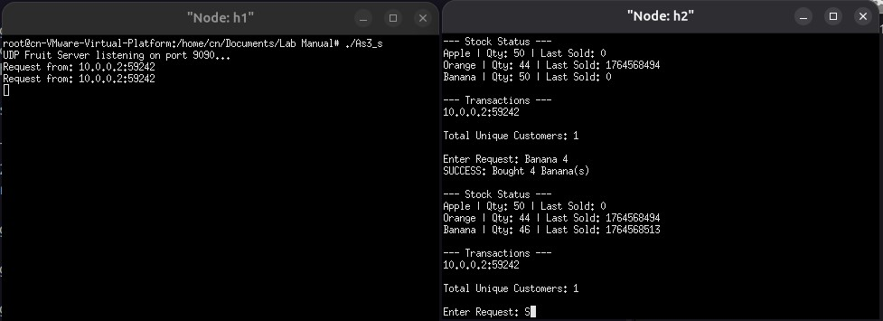

# COMPUTER NETWORKS : LAB MANUAL ASSIGNMENTS
## Q1. CN Lab – Assignment 1 
#### Objective:  
To gain first hands on experience of basic Socket Programming. 
#### Exercise:  
Write a program to run TCP client and server socket programs where client first 
says “Hi” and in response server says “Hello”.  
#### Steps/ Hints: (if any):  
1. Create two mininet hosts,  
2. Open the hosts individually in xterm windows, 
3. In one host, run tcpserver program and then in another run the tcpclient.  
#### Learning Outcomes:  
1. Basics of TCP client and server programming.
   
## OUTPUT 
### *[readme file](Assignment1/Readme.md)*
#### *EXECUTION*

## Q2. CN Lab – Assignment 2 
### Objective:  
To gain experience of TCP Socket Programming for simple applications. 
### Exercise:  
Write a program using TCP socket to implement the following:  
i. Server maintains records of fruits in the format: fruit-name, quantity Last-sold, (server timestamp),  
ii. Multiple client purchase the fruits one at a time,  
iii. The fruit quantity is updated each time any fruit is sold,  
iv. Send regret message to a client if therequested quantityof the fruit is not available.  
v. Display the customer ids <IP, port> who has done transactions already. This list should be updated in the server every time a transaction occurs.  
vi. The total number of unique customers who did some transaction will be displayed to the customer every time.  
### Steps/ Hints: (if any)   
1. Use at least two mininet hosts as clients,  
2. Server must be kept running using a loop condition, 
3. Take another socket (from accept() call) for keeping client information, 
4. Server must send the current stock information to the transacting host as queried in the question.     
### Learning Outcomes:  
1. Multiple client’s communication via server socket can be learned.

## OUTPUT 
### *[readme file](Assignment2/Readme.md)*
#### *EXECUTION*

## Q3. CN Lab – Assignment 3 
#### Objective: 
To gain experience of UDP Socket Programming for simple applications. 
#### Exercise: 
Redo assignment 2 using UDP socket.  
#### Steps/ Hints: (if any) 
Same as given in Assignment 1. 
#### Learning Outcomes:  
1. Basics of UDP socket programming. 

## OUTPUT 
#### *[readme file](Assignment3/Readme.md)*
#### *EXECUTION*

## Q4. CN Lab - Assignment 4  
#### Objective:  
To gain knowledge of packet capturing tools and understand header structures. 
#### Exercise:  
Install wireshark in a VM (Virtual Machine) environment. Draw a time diagram to show the steps in the protocols recorded in the captured file (saved in the .pcap file of wireshark) during a PING operation. List the L2, L3, L4 header fields that can be extracted from the .pcap file.  
#### Steps/ Hints: (if any)   
1. Install wireshark in your linux vm with mininet, 
2. Start capturing at any interface, 
3. Ping any two hosts, 
4. Analyze. 
#### Learning Outcomes:  
1. Knowledge of packet capturing tools, protocols and headers.
   
## OUTPUT 
#### *[readme file](Assignment4/Readme.md)*
#### *Wireshark capture file* :  [As4.pcapng](Assignment4/As4.pcapng) 
#### *HEADER INFO*

#### *EXECUTION*

## Q5. CN Lab - Assignment 5
#### Objective: 
To gain knowledge of more packet capturing tools. 
#### Exercise: 
Learn and use maximum number of packet generation tools.  
#### Steps/ Hints: (if any) 
1. Install Iperf, D-ITG etc. and send traffic among mininet hosts. 
#### Learning Outcomes:  
1. Knowledge of packet generation and capturing tools.

## OUTPUT
#### *[readme file](Assignment5/Readme.md)*
#### *EXECUTION*

## Q6. CN Lab - Assignment 6
#### Objective:  
To gain knowledge of more TCP/IP C libraries. 
#### Exercise:  
Develop a simple C based network simulator to analyze TCP traffic.  
#### Steps/ Hints: (if any)  
1. Use TCP/IP based C libraries including socket to listen to the incoming packets at 
the Ethernet port. 
2. Extract header and data of the incoming packets. 
#### Learning Outcomes:  
1. Knowledge of TCP/IP libraries.
   
## OUTPUT
#### *[readme file](Assignment6/Readme.md)*
#### *HEADER INFO*

#### *EXECUTION*

